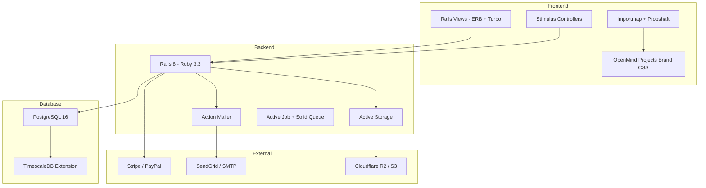
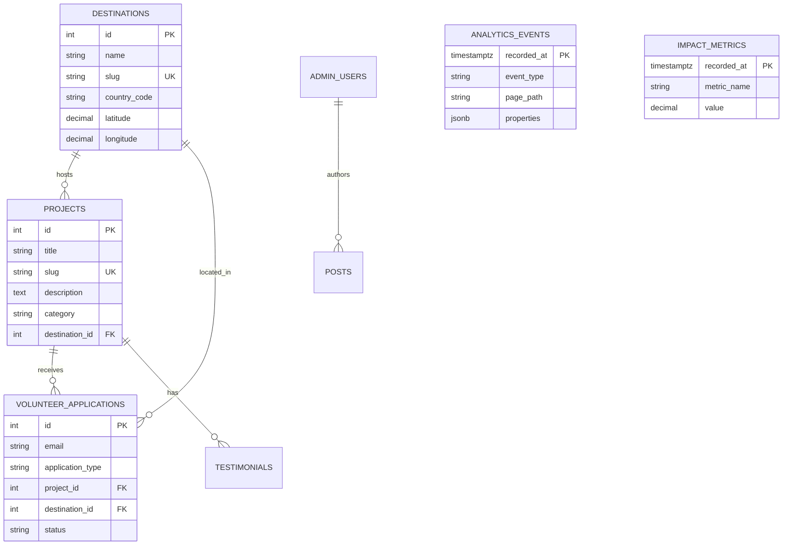
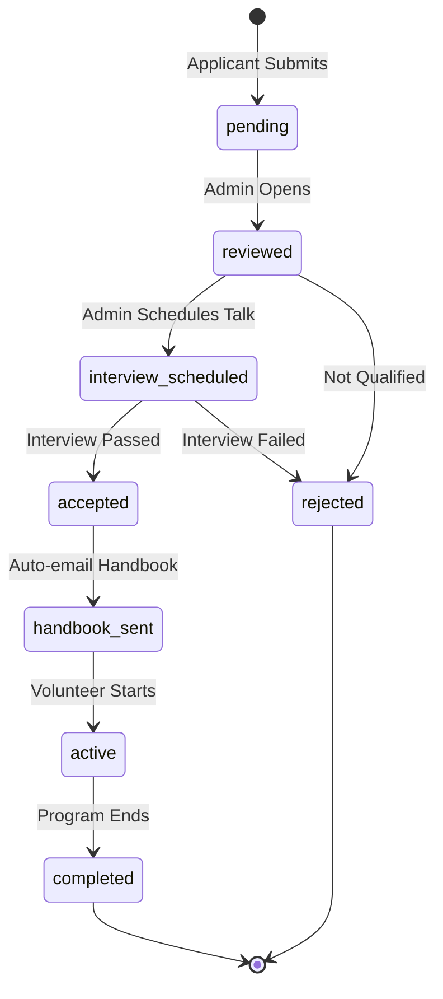
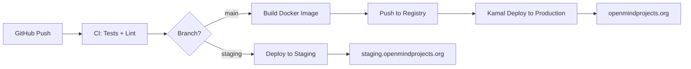

# OpenMind Projects — Official Website Redesign

## Implementation Plan: Ruby on Rails + PostgreSQL/TimescaleDB

> Migrating from WordPress/Elementor → **Rails 8 monolith**  
> Codename: `newomp` · Version: 1.0

---

## Executive Summary

Rebuild openmindprojects.org as a modern **Ruby on Rails 8** application using **server-rendered views** (ERB + Hotwire/Turbo), **PostgreSQL 16** with **TimescaleDB** for time-series analytics, and the **OpenMind Projects brand system** from `theme/`.



---

## 1. Current Site Audit

### 1.1 Existing Pages (WordPress/Elementor)

| Page | URL | Content Type |
|---|---|---|
| **Home** | `/` | Hero, 3-pillar cards, video gallery, partner logos, CTA |
| **About Us** | `/about` | Org history, vision/mission, founder story |
| **Projects** | `/project/` | 7 project cards with "Learn more" + "Apply" per card |
| **Destinations** | `/location/` | Thailand, Laos, Nepal location cards |
| **Who Volunteers** | `/volunteer-abroad/` | Volunteer types, testimonials, FAQ |
| **R&D** | `/research-development/` | R&D initiatives, tech partnerships |
| **Apply** | Off-canvas form (Elementor popup) | Multi-step application |
| **Donate** | External → fundhub.openskills.dev | Crowdfunding portal |

### 1.2 Current Project Listings (from `/project/`)

| # | Project | Slug |
|---|---|---|
| 1 | Fulbright ETA Internships | `/project/flta/` |
| 2 | Construction Volunteer Project in Thailand | `/project/free-construction-volunteer-thailand/` |
| 3 | Teach English in Nepal | `/project/teach-english-nepal/` |
| 4 | Thailand-Myanmar Border Volunteering | `/project/volunteer-burma-migrants/` |
| 5 | Learning Camps in Thailand | `/project/learning-camp-thailand/` |
| 6 | IT Training and Development | `/project/computer-training/` |
| 7 | Teaching Volunteer in Thailand | `/project/teaching-volunteer/` |

### 1.3 Problems with Current WordPress Site

- **No structured data** — Content locked in Elementor JSON blobs
- **Slow performance** — Multiple plugin dependencies, no caching strategy
- **No application pipeline** — Uses external form (sendimpact.com)
- **No analytics beyond page views** — No volunteer engagement tracking
- **Duplicate content** — Same "Application Process" block copy-pasted on every project
- **Mixed navigation** — Points to both `openmindprojects.org` and `newopm.openmindprojects.org`

---

## 2. Tech Stack

| Layer | Technology | Version | Rationale |
|---|---|---|---|
| **Language** | Ruby | 3.3+ | Latest stable, YJIT enabled |
| **Framework** | Rails | 8.0 | Hotwire by default, Solid Queue, Solid Cache |
| **Frontend** | ERB + Hotwire (Turbo + Stimulus) | — | Server-rendered, fast, no SPA complexity |
| **CSS** | Propshaft + Vanilla CSS (brand tokens) | — | Using OpenMind Projects brand tokens from `theme/` |
| **JS bundling** | Importmap | — | Rails 8 default, no Node.js needed |
| **Database** | PostgreSQL | 16+ | Robust, mature, great Rails integration |
| **Time-series** | TimescaleDB | 2.x | Hypertables for analytics events, metrics |
| **File Storage** | Active Storage + Cloudflare R2 | — | S3-compatible, cost-effective |
| **Background Jobs** | Solid Queue | — | Rails 8 built-in, no Redis needed |
| **Caching** | Solid Cache | — | DB-backed caching, Rails 8 default |
| **Email** | Action Mailer + SendGrid | — | Transactional emails |
| **Auth** | Devise or built-in `has_secure_password` | — | Admin panel authentication |
| **Search** | pg_search | — | Full-text search via PostgreSQL |
| **Deployment** | Docker + Kamal or Easypanel | — | Containerized deployment |

---

## 3. Information Architecture

### 3.1 Sitemap

```
/                           → PagesController#home
/about                      → PagesController#about
/projects                   → ProjectsController#index
/projects/:slug             → ProjectsController#show
/destinations               → DestinationsController#index
/destinations/:slug         → DestinationsController#show
/volunteer                  → PagesController#volunteer
/research-development       → PagesController#research
/news                       → PostsController#index
/news/:slug                 → PostsController#show
/apply                      → ApplicationsController#new
/apply (POST)               → ApplicationsController#create
/donate                     → redirect to fundhub.openskills.dev
/contact                    → ContactsController#new

--- Admin ---
/admin                      → Admin::DashboardController#index
/admin/projects             → Admin::ProjectsController (CRUD)
/admin/destinations         → Admin::DestinationsController (CRUD)
/admin/posts                → Admin::PostsController (CRUD)
/admin/applications         → Admin::ApplicationsController (index/show/update)
/admin/team_members         → Admin::TeamMembersController (CRUD)
/admin/partners             → Admin::PartnersController (CRUD)
/admin/testimonials         → Admin::TestimonialsController (CRUD)
/admin/analytics            → Admin::AnalyticsController#index
/admin/settings             → Admin::SettingsController (site config)
```

### 3.2 Page → Content Mapping

| Page | Dynamic Content Needed |
|---|---|
| Home | Hero settings, impact stats, featured projects, partner logos, testimonial videos |
| About | Vision/mission (editable), founder bios, org timeline |
| Projects | Project listing with filters, each with gallery + details |
| Destinations | Location cards with map, linked projects |
| Volunteer | Volunteer type info, FAQ, testimonials |
| R&D | Research initiatives, tech stack, open positions |
| News | Blog posts with categories and tags |
| Apply | Multi-step form with file uploads |

---

## 4. Database Schema

### 4.1 Core Tables (PostgreSQL)

```ruby
# db/migrate/001_create_projects.rb
create_table :projects do |t|
  t.string   :title, null: false
  t.string   :slug, null: false, index: { unique: true }
  t.text     :summary             # Short description for cards
  t.text     :description         # Rich text (Action Text)
  t.string   :category            # education, construction, teaching, it_training
  t.string   :status, default: 'active'  # active, paused, archived
  t.string   :location_name       # e.g., "Chonburi, Thailand"
  t.references :destination, foreign_key: true
  t.integer  :duration_weeks_min
  t.integer  :duration_weeks_max
  t.string   :cover_image_alt
  t.integer  :position, default: 0  # sorting
  t.jsonb    :meta, default: {}     # flexible metadata
  t.timestamps
end

# db/migrate/002_create_destinations.rb
create_table :destinations do |t|
  t.string   :name, null: false           # Thailand, Laos, Nepal
  t.string   :slug, null: false, index: { unique: true }
  t.text     :summary
  t.text     :description
  t.string   :country_code, limit: 2      # TH, LA, NP
  t.decimal  :latitude, precision: 10, scale: 7
  t.decimal  :longitude, precision: 10, scale: 7
  t.string   :status, default: 'active'
  t.integer  :position, default: 0
  t.jsonb    :meta, default: {}
  t.timestamps
end

# db/migrate/003_create_volunteer_applications.rb
create_table :volunteer_applications do |t|
  t.string   :first_name, null: false
  t.string   :last_name, null: false
  t.string   :email, null: false
  t.string   :phone
  t.string   :nationality
  t.date     :date_of_birth
  t.string   :application_type    # volunteer_onsite, volunteer_online, internship
  t.references :project, foreign_key: true, null: true
  t.references :destination, foreign_key: true, null: true
  t.date     :preferred_start_date
  t.integer  :duration_weeks
  t.text     :skills
  t.text     :motivation
  t.text     :experience
  t.string   :status, default: 'pending'  # pending, reviewed, accepted, rejected
  t.text     :admin_notes
  t.jsonb    :meta, default: {}
  t.timestamps
end

# db/migrate/004_create_team_members.rb
create_table :team_members do |t|
  t.string   :name, null: false
  t.string   :role, null: false
  t.string   :department          # education, technology, community, research
  t.text     :bio
  t.string   :linkedin_url
  t.string   :github_url
  t.integer  :position, default: 0
  t.boolean  :active, default: true
  t.timestamps
end

# db/migrate/005_create_partners.rb
create_table :partners do |t|
  t.string   :name, null: false      # UNESCO, Google, CNN...
  t.string   :url
  t.string   :tier, default: 'standard'  # featured, standard
  t.integer  :position, default: 0
  t.boolean  :active, default: true
  t.timestamps
end

# db/migrate/006_create_posts.rb
create_table :posts do |t|
  t.string   :title, null: false
  t.string   :slug, null: false, index: { unique: true }
  t.text     :summary
  t.text     :body                    # Action Text rich text
  t.string   :category               # news, story, update
  t.string   :status, default: 'draft'  # draft, published, archived
  t.datetime :published_at
  t.references :author, foreign_key: { to_table: :admin_users }
  t.jsonb    :meta, default: {}
  t.timestamps
end

# db/migrate/007_create_testimonials.rb
create_table :testimonials do |t|
  t.string   :name, null: false
  t.string   :role                    # "Volunteer 2024", "Intern"
  t.text     :quote
  t.string   :video_url              # YouTube embed
  t.string   :country
  t.references :project, foreign_key: true, null: true
  t.boolean  :featured, default: false
  t.integer  :position, default: 0
  t.timestamps
end

# db/migrate/008_create_admin_users.rb
create_table :admin_users do |t|
  t.string   :email, null: false, index: { unique: true }
  t.string   :password_digest
  t.string   :name
  t.string   :role, default: 'editor'  # superadmin, admin, editor
  t.timestamps
end

# db/migrate/009_create_site_settings.rb
create_table :site_settings do |t|
  t.string   :key, null: false, index: { unique: true }
  t.text     :value
  t.string   :value_type, default: 'string'  # string, integer, boolean, json
  t.timestamps
end

# db/migrate/010_create_contact_messages.rb
create_table :contact_messages do |t|
  t.string   :name, null: false
  t.string   :email, null: false
  t.string   :subject
  t.text     :message
  t.string   :status, default: 'unread'  # unread, read, replied
  t.timestamps
end
```

### 4.2 TimescaleDB Hypertables (Analytics)

```ruby
# db/migrate/011_create_analytics_events.rb
create_table :analytics_events, id: false do |t|
  t.timestamptz :recorded_at, null: false
  t.string      :event_type, null: false   # page_view, apply_click, donate_click, form_submit
  t.string      :page_path
  t.string      :referrer
  t.string      :country
  t.string      :device_type                # desktop, mobile, tablet
  t.string      :session_id
  t.jsonb       :properties, default: {}    # flexible event properties
end

# Convert to hypertable in a migration
execute "SELECT create_hypertable('analytics_events', 'recorded_at');"

# db/migrate/012_create_impact_metrics.rb
create_table :impact_metrics, id: false do |t|
  t.timestamptz :recorded_at, null: false
  t.string      :metric_name, null: false  # volunteers_count, workshops_count, students_trained
  t.decimal     :value, null: false
  t.string      :unit                      # count, hours, currency
  t.string      :source                    # manual, automated
  t.jsonb       :meta, default: {}
end

execute "SELECT create_hypertable('impact_metrics', 'recorded_at');"

# Continuous aggregates for dashboard
execute <<-SQL
  CREATE MATERIALIZED VIEW daily_page_views
  WITH (timescaledb.continuous) AS
  SELECT
    time_bucket('1 day', recorded_at) AS bucket,
    page_path,
    COUNT(*) AS views,
    COUNT(DISTINCT session_id) AS unique_visitors
  FROM analytics_events
  WHERE event_type = 'page_view'
  GROUP BY bucket, page_path;
SQL
```

### 4.3 Entity Relationship Diagram



---

## 5. Rails Application Structure

### 5.1 Key Models

```
app/models/
├── project.rb
├── destination.rb
├── volunteer_application.rb
├── team_member.rb
├── partner.rb
├── post.rb
├── testimonial.rb
├── admin_user.rb
├── site_setting.rb
├── contact_message.rb
├── analytics_event.rb
└── impact_metric.rb
```

### 5.2 Key Controllers

```
app/controllers/
├── pages_controller.rb          # home, about, volunteer, research
├── projects_controller.rb       # index, show
├── destinations_controller.rb   # index, show
├── posts_controller.rb          # index, show
├── applications_controller.rb   # new, create (public-facing)
├── contacts_controller.rb       # new, create
├── analytics_controller.rb      # track (JS beacon endpoint)
└── admin/
    ├── base_controller.rb       # auth, layout
    ├── dashboard_controller.rb
    ├── projects_controller.rb
    ├── destinations_controller.rb
    ├── posts_controller.rb
    ├── applications_controller.rb
    ├── team_members_controller.rb
    ├── partners_controller.rb
    ├── testimonials_controller.rb
    ├── analytics_controller.rb
    └── settings_controller.rb
```

### 5.3 Key Views (ERB)

```
app/views/
├── layouts/
│   ├── application.html.erb     # Public layout (navbar + footer from theme)
│   └── admin.html.erb           # Admin panel layout
├── shared/
│   ├── _navbar.html.erb
│   ├── _footer.html.erb
│   ├── _section_header.html.erb
│   ├── _pillar_card.html.erb
│   ├── _project_card.html.erb
│   └── _testimonial_card.html.erb
├── pages/
│   ├── home.html.erb            # Hero, pillars, impact, programs, recognized
│   ├── about.html.erb
│   ├── volunteer.html.erb
│   └── research.html.erb
├── projects/
│   ├── index.html.erb
│   └── show.html.erb
├── destinations/
│   ├── index.html.erb
│   └── show.html.erb
├── posts/
│   ├── index.html.erb
│   └── show.html.erb
├── applications/
│   ├── new.html.erb             # Multi-step Turbo form
│   └── _step_*.html.erb
└── admin/
    ├── dashboard/
    │   └── index.html.erb       # TimescaleDB analytics charts
    └── ... (standard CRUD views)
```

### 5.4 Stimulus Controllers

```
app/javascript/controllers/
├── navbar_controller.js         # Scroll effects, hamburger toggle
├── counter_controller.js        # Animated number counters
├── reveal_controller.js         # Scroll-reveal animations
├── particles_controller.js      # Hero particle background
├── application_form_controller.js  # Multi-step form logic
├── analytics_controller.js      # Page view tracking beacon
└── chart_controller.js          # Admin dashboard charts (Chart.js)
```

---

## 6. Key Feature Implementations

### 6.1 Volunteer Application Pipeline



### 6.2 Analytics (TimescaleDB)

The admin dashboard uses TimescaleDB continuous aggregates for:

| Metric | Query Type |
|---|---|
| Daily page views per path | Continuous aggregate (1-day bucket) |
| Unique visitors / day | `COUNT(DISTINCT session_id)` in aggregate |
| Application funnel | Event-based: `page_view /apply` → `form_submit` |
| Geographic distribution | `GROUP BY country` from events |
| Impact metrics over time | Hypertable with metric snapshots |

### 6.3 Admin CMS

Lightweight, built-in admin panel (no gems like ActiveAdmin):
- CRUD for all content models
- Rich text editing via **Action Text** (Trix editor)
- Image uploads via **Active Storage**
- Application review workflow with status updates + email notifications
- Dashboard with TimescaleDB-powered charts

---

## 7. Phased Implementation

### Phase 1 — Foundation (Week 1-2)

| Task | Details |
|---|---|
| ✅ Rails 8 app init | `rails new newomp --database=postgresql --css=propshaft --javascript=importmap` |
| ✅ PostgreSQL + TimescaleDB setup | Docker compose with `timescale/timescaledb:latest-pg16` |
| ✅ Database migrations | All core tables + hypertables |
| ✅ Model layer | Validations, associations, scopes |
| ✅ Seed data | Import 7 projects, 3 destinations, partners from current site |
| ✅ Brand CSS integration | Port `theme/index.css` → `app/assets/stylesheets/` |

### Phase 2 — Public Pages (Week 3-4)

| Task | Details |
|---|---|
| Layout + partials | Navbar, footer, section headers from theme |
| Home page | Hero, pillars, impact stats, programs, recognized-by |
| About page | Vision/mission, founder story, timeline |
| Projects index + show | Filterable grid, individual project pages |
| Destinations index + show | Location cards with linked projects |
| Volunteer page | Types, FAQ, testimonials |
| R&D page | Research initiatives, tech overview |

### Phase 3 — Interactive Features (Week 5-6)

| Task | Details |
|---|---|
| Application form | Multi-step Turbo form with file uploads |
| Contact form | Simple message form with email notification |
| Stimulus controllers | Navbar scroll, counters, reveal, particles |
| Turbo Frames | Dynamic project filtering without full reload |
| SEO | Meta tags, Open Graph, structured data (JSON-LD) |

### Phase 4 — Admin Panel (Week 7-8)

| Task | Details |
|---|---|
| Admin auth | Login, session management, role-based access |
| Content CRUD | Projects, destinations, posts, team, partners, testimonials |
| Application management | Review queue, status workflow, email triggers |
| Rich text + images | Action Text + Active Storage integration |
| Site settings | Editable hero text, impact numbers, etc. |

### Phase 5 — Analytics & Blog (Week 9-10)

| Task | Details |
|---|---|
| Analytics tracking | JS beacon → `/analytics/track` endpoint |
| TimescaleDB aggregates | Continuous aggregates for dashboard |
| Admin dashboard | Charts (page views, applications, geo) |
| Blog / News | CRUD, categories, RSS feed |
| Email notifications | Application received, status change, newsletter |

### Phase 6 — Polish & Deploy (Week 11-12)

| Task | Details |
|---|---|
| Responsive testing | Mobile, tablet, desktop |
| Performance | Caching (Solid Cache), image optimization, Turbo prefetch |
| Accessibility | WCAG AA compliance audit |
| Docker + deployment | Dockerfile, docker-compose, Kamal/Easypanel config |
| DNS cutover | Point openmindprojects.org → new Rails app |
| Content migration | Final content import from WordPress |

---

## 8. Docker Compose (Development)

```yaml
# docker-compose.yml
services:
  db:
    image: timescale/timescaledb:latest-pg16
    environment:
      POSTGRES_USER: newomp
      POSTGRES_PASSWORD: ${DB_PASSWORD:-devpassword}
      POSTGRES_DB: newomp_development
    ports:
      - "5432:5432"
    volumes:
      - pgdata:/var/lib/postgresql/data

  web:
    build: .
    command: bin/rails server -b 0.0.0.0
    ports:
      - "3000:3000"
    environment:
      DATABASE_URL: postgres://newomp:${DB_PASSWORD:-devpassword}@db:5432/newomp_development
      RAILS_ENV: development
    volumes:
      - .:/app
      - bundle_cache:/usr/local/bundle
    depends_on:
      - db

volumes:
  pgdata:
  bundle_cache:
```

---

## 9. Gemfile (Key Dependencies)

```ruby
# Gemfile
source "https://rubygems.org"

gem "rails", "~> 8.0"
gem "pg", "~> 1.5"              # PostgreSQL adapter
gem "puma", ">= 6.0"            # Web server
gem "propshaft"                  # Asset pipeline
gem "importmap-rails"            # JS without Node.js
gem "turbo-rails"                # Hotwire Turbo
gem "stimulus-rails"             # Hotwire Stimulus
gem "jbuilder"                   # JSON APIs if needed

# Content & Files
gem "image_processing", "~> 1.2" # Active Storage variants
gem "aws-sdk-s3"                 # Cloudflare R2 / S3 storage

# Search
gem "pg_search"                  # PostgreSQL full-text search

# Auth
gem "bcrypt", "~> 3.1"          # has_secure_password

# SEO
gem "meta-tags"                  # SEO meta tags helper
gem "sitemap_generator"          # XML sitemap

# Email
gem "sendgrid-ruby"              # SendGrid API (optional)

# Admin utilities
gem "pagy"                       # Pagination
gem "ransack"                    # Search/filter in admin

# Background Jobs (Rails 8 built-in)
gem "solid_queue"
gem "solid_cache"
gem "solid_cable"

group :development do
  gem "web-console"
  gem "rack-mini-profiler"
  gem "letter_opener"            # Preview emails in browser
end

group :development, :test do
  gem "debug"
  gem "rspec-rails"
  gem "factory_bot_rails"
  gem "faker"
end
```

---

## 10. Deployment Strategy



| Environment | URL | Database |
|---|---|---|
| Development | localhost:3000 | `newomp_development` (local TimescaleDB) |
| Staging | staging.openmindprojects.org | `newomp_staging` (Easypanel) |
| Production | openmindprojects.org | `newomp_production` (Easypanel) |

---

## 11. File Structure Summary

```
newomp/
├── app/
│   ├── assets/
│   │   └── stylesheets/
│   │       ├── application.css      # imports all below
│   │       ├── _tokens.css          # OpenMind Projects brand tokens
│   │       ├── _reset.css
│   │       ├── _typography.css
│   │       ├── _buttons.css
│   │       ├── _cards.css
│   │       ├── _navbar.css
│   │       ├── _hero.css
│   │       ├── _sections.css
│   │       ├── _forms.css
│   │       ├── _footer.css
│   │       └── admin.css            # admin panel styles
│   ├── controllers/
│   ├── javascript/
│   │   └── controllers/             # Stimulus
│   ├── models/
│   ├── views/
│   └── mailers/
├── config/
│   ├── routes.rb
│   ├── database.yml
│   └── deploy.yml                   # Kamal config
├── db/
│   ├── migrate/
│   └── seeds.rb
├── theme/                           # ← existing brand assets
│   ├── BRAND_GUIDE.md               # OpenMind Projects brand reference
│   ├── index.html                   # reference template
│   ├── index.css                    # source CSS to port
│   └── index.js                     # source JS to port to Stimulus
├── Dockerfile
├── docker-compose.yml
└── Gemfile
```

---

## 12. Decision Points for Review

> [!IMPORTANT]
> The following decisions need your input before starting Phase 1:

| # | Decision | Options |
|---|---|---|
| 1 | **Admin auth approach** | A) Devise gem (full-featured) · B) Built-in `has_secure_password` (simpler) |
| 2 | **Rich text editor** | A) Action Text / Trix (Rails built-in) · B) TipTap via Stimulus |
| 3 | **Donation integration** | A) Keep external fundhub link · B) Embed Stripe inline |
| 4 | **Deployment target** | A) Easypanel (existing infra) · B) Kamal to VPS · C) Fly.io |
| 5 | **Blog scope** | A) Full blog with categories/tags · B) Simple news feed |
| 6 | **Branding** | ✅ Resolved: **OpenMind Projects** primary brand throughout (AI Codex is a separate sub-brand) |
| 7 | **Application form host** | A) Built-in Rails form · B) Keep sendimpact.com external |
| 8 | **Start Phase 1 now?** | Ready to scaffold the Rails app and database |

---

*Plan created: May 4, 2026 · Based on analysis of openmindprojects.org · Brand: OpenMind Projects*
