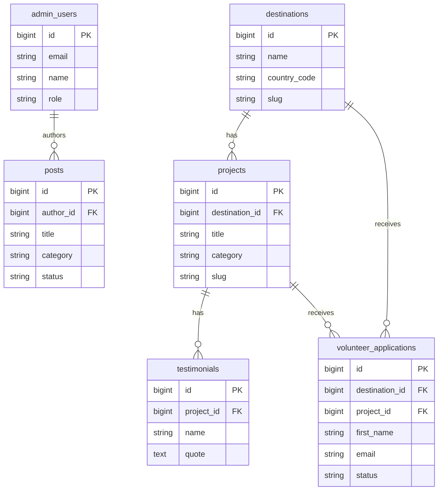

# Database Entity-Relationship Diagram

```mermaid
erDiagram
    admin_users ||--o{ posts : "authors"
    destinations ||--o{ projects : "has"
    destinations ||--o{ volunteer_applications : "receives"
    projects ||--o{ testimonials : "has"
    projects ||--o{ volunteer_applications : "receives"

    admin_users {
        bigint id PK
        string email
        string name
        string role
    }

    posts {
        bigint id PK
        bigint author_id FK
        string title
        string category
        string status
    }

    destinations {
        bigint id PK
        string name
        string country_code
        string slug
    }

    projects {
        bigint id PK
        bigint destination_id FK
        string title
        string category
        string slug
    }

    testimonials {
        bigint id PK
        bigint project_id FK
        string name
        text quote
    }

    volunteer_applications {
        bigint id PK
        bigint destination_id FK
        bigint project_id FK
        string first_name
        string email
        string status
    }
```
