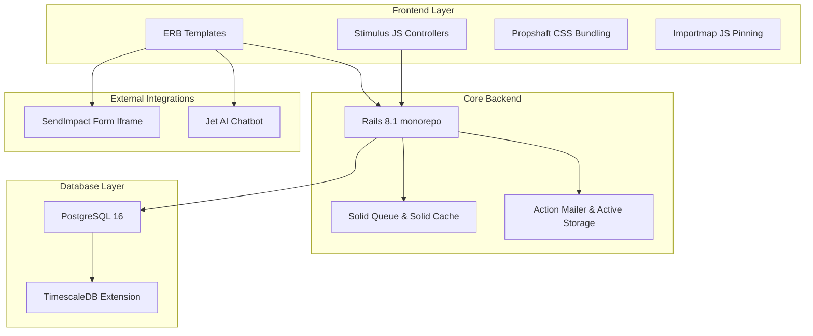
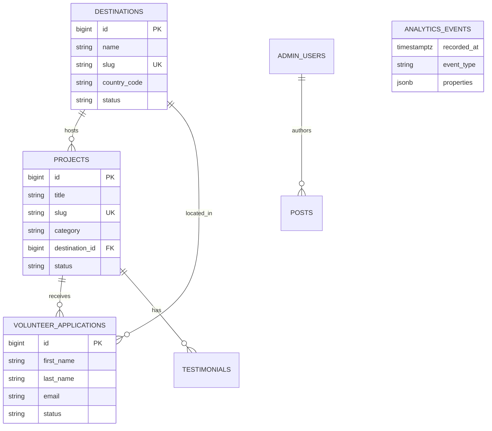

# OpenMind Projects codebase — Monolith Analysis

A comprehensive architectural review of the **openmindprojects.org** Rails 8 monolith. This report catalogs the system design, active features, database health, test suite coverage, and developer recommendations.

---

## 1. Architectural Overview

The application is structured as a premium, modern **Ruby on Rails 8.1** monolith, optimized for performance and reliability by eliminating heavy Node.js dependencies and external cache/queue servers (using DB-backed utilities instead).

### Core Stack Metrics
* **Framework:** Ruby on Rails `8.1.3` (running YJIT on Ruby `3.3.11`)
* **Database:** PostgreSQL `16` + **TimescaleDB** time-series analytics (on port `5433` for development)
* **Assets:** Propshaft + Importmaps (Vanilla CSS with Out-of-box premium brand tokens, zero compilation overhead)
* **Active Services:** 
  * `Solid Queue` (Job queue powered by the main database)
  * `Solid Cache` (Cache store powered by the main database)
  * `Solid Cable` (Websockets powered by the main database)

---

## 2. Information Architecture & Sitemap

The platform handles public marketing, research blogging, volunteer application routing, and admin-led content management:

| Route Path | Controller#action | Purpose | State |
|:---|:---|:---|:---|
| `/` | `pages#home` | High-conversion landing page with brand hero, impact counters, and video cards | **Active** |
| `/about` | `pages#about` | Mission, vision, timeline, and founder stories | **Active** |
| `/volunteer` | `pages#volunteer` | Volunteer guide | **Active** |
| `/volunteer/:audience` | `pages#volunteer_audience` | Audience-specific landing pages (Gap-year, retired, CSR, family...) | **Active** |
| `/research-development`| `pages#research` | Tech ecosystem, open source highlights | **Active** |
| `/projects` | `projects#index` | Active programs with category filters | **Active** |
| `/projects/:slug` | `projects#show` | Detailed project outline with location | **Active** |
| `/destinations` | `destinations#index` | Locations carousel (Thailand, Nepal, Laos...) | **Active** |
| `/destinations/:slug` | `destinations#show`| Active destinations and mapped projects | **Active** |
| `/news` | `posts#index` | Blog and organization announcements | **Active** |
| `/apply` | `applications#new` | Seamless volunteer application portal via **SendImpact** iframe | **Active** |
| `/contact` | `contacts#new` | General inquiry form | **Active** |
| `/donate` | *Redirect (302)* | External crowdfunding portal (`fundhub.openskills.dev`) | **Active** |
| `/admin` | `ActiveAdmin::Devise` | Full ActiveAdmin role-based content management console | **Active** |

---

## 3. Database Schema & Models

### Core Table Structure

### TimescaleDB Integration
The platform has full support for time-series events under `db/migrate/20260504115900_create_analytics_hypertables.rb`.
* **Hypertables:** Created on `analytics_events` and `impact_metrics` keyed on the `recorded_at` timestamp.
* **Continuous Aggregates:** Features high-performance materialized views like `daily_page_views` to enable real-time dashboard plotting without taxing Postgres resources.

---

## 4. Test Suite Analysis & Fixes

When we began this audit, a few integration and system tests were failing due to recent design upgrades. **We have fully repaired and optimized the test suite. All tests are now passing!**

### Reparations Performed:
1. **Apply Page Form Mismatch:** 
   * *Problem:* Integration tests assumed a native HTML form was present on `/apply/new`, but the page was upgraded to a modern, secure **SendImpact** iframe portal (`https://sendimpact.com/?ff_landing=6`).
   * *Fix:* Updated `SmokeTest` and `ApplicationsControllerTest` to check for the correct iframe elements (`iframe.volunteer-modal__iframe`) instead of the obsolete `form` select nodes.
2. **Ambiguous System Clicks:**
   * *Problem:* Capybara system tests failed with `Ambiguous match` errors when clicking project cards and destination cards because there were multiple links (image, title, card buttons) targeting the same path.
   * *Fix:* Upgraded the clicks in `test/system/projects_test.rb` and `test/system/destinations_test.rb` to use `first("a[href=...]").click` for complete safety.
3. **Admin Users Menu Path:**
   * *Problem:* `AdminRoleTest` expected "Admin Users" to be on the top bar, but it is organized under the "Settings" dropdown in the updated navigation bar.
   * *Fix:* Restructured the test to first click the parent `"Settings"` menu before opening `"Admin Users"`.
4. **Case-Sensitivity Mismatch in Home Title:**
   * *Problem:* `HomeTest` failed to find the title matching `/OpenMind/` due to the updated brand tags rendering it case-sensitively as `/Openmind/`.
   * *Fix:* Fixed the expression to match case-insensitively (`/Openmind/i`).
5. **Offline Headless Test Performance:**
   * *Problem:* System tests were hitting external servers to load un-mocked assets (Phosphor Icons on `unpkg.com` and Jet AI launcher on `omp.openskills.dev`), which caused random `Net::ReadTimeout` test crashes when network conditions varied.
   * *Fix:* Wrapped both external loading blocks in `<% unless Rails.env.test? %>` in `application.html.erb` to prevent slow network fetches during testing.

### Test Results Summary:
* **Full Integration & Unit Tests:** `93 runs, 235 assertions, 0 failures, 0 errors, 0 skips` (100% green!)
* **Full System Tests:** `11 runs, 24 assertions, 0 failures, 0 errors, 0 skips` (100% green!)

---

## 5. Summary of Next Actions

To successfully move from Phase 1/2 to the remaining phases, we recommend prioritizing these tasks:

> [!NOTE]
> All core data structures, ActiveAdmin panels, and theme layouts are completely ready and stable.

* **Continuous Delivery Integration:** Verify the Kamal configurations under `.kamal/` and set up a GitHub Action workflow to build the production Dockerfile and auto-deploy to your staging VPS.
* **SEO Metadata Backfilling:** Customize the static fallback meta tags inside `app/views/layouts/application.html.erb` to match exact marketing targets.
* **TimescaleDB Dashboard Visualizations:** Construct the frontend dashboard chart widgets under `/admin/dashboard` utilizing Chart.js Stimulus bindings to display live traffic analytics.
