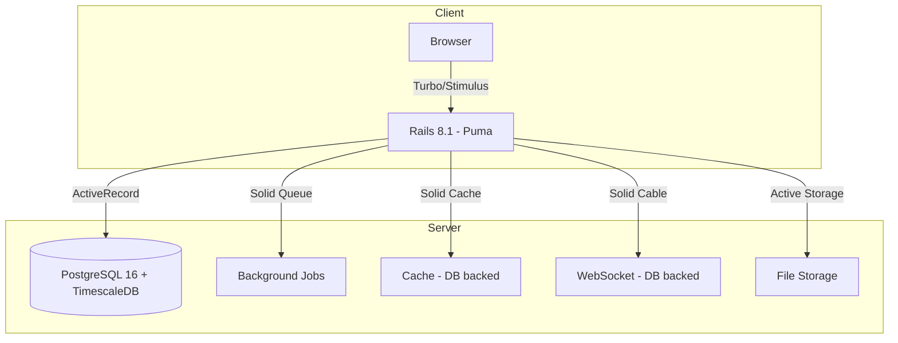

# OpenMind Projects — Project Analysis & Local Deploy

## Project Overview

| Property | Value |
|---|---|
| **Name** | OpenMind Projects (openmindprojects.org) |
| **Type** | Rails 8.1 monolith — server-rendered (ERB + Hotwire) |
| **Ruby** | 3.3.11 |
| **Rails** | 8.1.3 |
| **Database** | PostgreSQL 16 + TimescaleDB (via Docker, port 5433) |
| **Asset Pipeline** | Propshaft + Importmap (no Webpack/esbuild) |
| **JS Framework** | Hotwire (Turbo + Stimulus) |
| **CSS** | DartSass + brand design tokens |
| **Auth** | Devise + CanCanCan (role-based: superadmin/admin/editor) |
| **Admin UI** | ActiveAdmin at `/admin` |
| **Deploy Target** | Kamal + Thruster (production Docker) |

## Architecture



## Key Models (10)

| Model | Purpose |
|---|---|
| `Project` | Volunteer projects (slugged) |
| `Destination` | Countries/regions (slugged, with locations) |
| `Post` | News/blog articles |
| `AdminUser` | Auth with roles (Devise) |
| `VolunteerApplication` | Application form submissions |
| `ContactMessage` | Contact form submissions |
| `Partner` | Partner organizations (tiered) |
| `TeamMember` | Staff/team directory |
| `Testimonial` | Volunteer testimonials |
| `SiteSetting` | Key-value config (hero text, impact stats) |

## Routes Summary

| Path | Purpose |
|---|---|
| `/` | Homepage |
| `/about` | About page |
| `/volunteer` | Volunteer landing + audience sub-pages |
| `/research-development` | R&D page |
| `/projects`, `/projects/:slug` | Project listing & detail |
| `/destinations`, `/destinations/:slug` | Destination listing & detail |
| `/news`, `/news/:slug` | Blog/news |
| `/apply/new` | Volunteer application form |
| `/contact/new` | Contact form |
| `/admin` | ActiveAdmin dashboard |
| `/donate` | Redirects to external fundhub |

## Port Conflict

> [!WARNING]
> **Port 3000** is currently in use by `tradex-frontend` (another Docker container). The Rails server will be started on **port 3001** instead.

## Local Deploy Steps (Executed)

1. ✅ **Prerequisites verified**: Ruby 3.3.11, Rails 8.1.3, Bundler 2.5.22, Docker 29.1.1
2. ✅ **Gems installed**: `bundle check` passes
3. 🔄 **Docker DB**: `docker compose up -d` (TimescaleDB on `:5433`)
4. 🔄 **Database setup**: `bin/rails db:prepare` (create + migrate + seed)
5. 🔄 **Boot server**: `bin/rails server -p 3001`

## Admin Credentials

```
URL:      http://localhost:3001/admin/login
Email:    admin@openmindprojects.org
Password: changeme123
```
