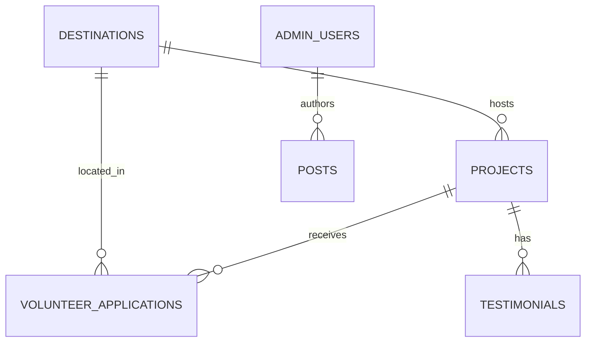

# Workspace Analysis — OpenMind Projects (`omp`)

> **Path:** `/Users/utku/Utku/omp`
> **Analyzed:** 2026-05-07

---

## 1. Project Overview

**OpenMind Projects** is a website redesign migrating from WordPress/Elementor to a **Ruby on Rails 8 monolith**. The site serves [openmindprojects.org](https://openmindprojects.org) — a volunteer organization operating in Thailand, Laos, and Nepal.

| Attribute | Value |
|---|---|
| **Ruby** | 3.3.11 |
| **Rails** | 8.1.3 |
| **Database** | PostgreSQL 16 + TimescaleDB |
| **Frontend** | ERB + Hotwire (Turbo + Stimulus) |
| **Asset pipeline** | Propshaft + Importmap (no Node.js) |
| **Admin UI** | ActiveAdmin + Devise + CanCanCan |
| **Background jobs** | Solid Queue (DB-backed, no Redis) |
| **Caching** | Solid Cache |
| **WebSockets** | Solid Cable |
| **Deployment** | Docker + Kamal + Thruster |

---

## 2. Git History

```
7c8f2dd (HEAD → master) test:admin
43c60ce admin page
6693c58 fullstack rail
9289ccc openmind website
```

4 commits across 3 branches: `master`, `openmind-app-v1`, `openmind-app-v2`, `openmind-app-v3`.

---

## 3. Directory Structure

```
omp/
├── app/
│   ├── admin/              # 11 ActiveAdmin resource files (dashboard + 10 models)
│   ├── assets/
│   │   ├── builds/         # Compiled SCSS output (dartsass-rails)
│   │   ├── images/
│   │   ├── javascripts/
│   │   └── stylesheets/    # 5 files: brand.css, application.css, active_admin.scss, etc.
│   ├── controllers/        # 6 controllers (5 public + ApplicationController)
│   ├── helpers/
│   ├── javascript/
│   │   └── controllers/    # 7 Stimulus controllers
│   ├── jobs/
│   ├── mailers/
│   ├── models/             # 12 model files + concerns/
│   └── views/              # 9 view directories
├── config/
│   ├── routes.rb           # Public routes + ActiveAdmin + Devise
│   ├── database.yml        # PostgreSQL on :5433 (Docker)
│   ├── importmap.rb
│   └── ...                 # 17 config files + 3 subdirs
├── db/
│   ├── migrate/            # 15 migration files
│   ├── schema.rb           # 263 lines, 15 tables
│   └── seeds.rb            # 6.8 KB seed data
├── devplan/                # Implementation plans
├── theme/                  # Brand reference assets (HTML/CSS/JS/images)
├── test/                   # Model, controller, and system tests
├── Gemfile                 # 28 gems
├── Dockerfile              # Multi-stage production image
├── docker-compose.yml      # TimescaleDB on :5433
├── IMPLEMENTATION_PLAN.md  # 778-line phased roadmap
└── README.md               # 187-line project documentation
```

---

## 4. Models (12 total)

| Model | File | Key Attributes |
|---|---|---|
| **Project** | [project.rb](file:///Users/utku/Utku/omp/app/models/project.rb) | title, slug, summary, description, category, status, destination_id |
| **Destination** | [destination.rb](file:///Users/utku/Utku/omp/app/models/destination.rb) | name, slug, country_code, lat/lng, status |
| **VolunteerApplication** | [volunteer_application.rb](file:///Users/utku/Utku/omp/app/models/volunteer_application.rb) | first/last name, email, application_type, project_id, status |
| **Post** | [post.rb](file:///Users/utku/Utku/omp/app/models/post.rb) | title, slug, body, category, status, published_at, author_id |
| **AdminUser** | [admin_user.rb](file:///Users/utku/Utku/omp/app/models/admin_user.rb) | email, encrypted_password (Devise), role (superadmin/admin/editor) |
| **TeamMember** | [team_member.rb](file:///Users/utku/Utku/omp/app/models/team_member.rb) | name, role, department, bio, active |
| **Partner** | [partner.rb](file:///Users/utku/Utku/omp/app/models/partner.rb) | name, url, tier, active |
| **Testimonial** | [testimonial.rb](file:///Users/utku/Utku/omp/app/models/testimonial.rb) | name, role, quote, video_url, project_id, featured |
| **SiteSetting** | [site_setting.rb](file:///Users/utku/Utku/omp/app/models/site_setting.rb) | key, value, value_type (string/integer/boolean/json) |
| **ContactMessage** | [contact_message.rb](file:///Users/utku/Utku/omp/app/models/contact_message.rb) | name, email, subject, message, status |
| **Ability** | [ability.rb](file:///Users/utku/Utku/omp/app/models/ability.rb) | CanCanCan role-based authorization |
| **ApplicationRecord** | [application_record.rb](file:///Users/utku/Utku/omp/app/models/application_record.rb) | Base model |

### Entity Relationships



---

## 5. Controllers (Public)

| Controller | Actions | Route |
|---|---|---|
| [PagesController](file:///Users/utku/Utku/omp/app/controllers/pages_controller.rb) | home, about, volunteer, research | `/`, `/about`, `/volunteer`, `/research-development` |
| [ProjectsController](file:///Users/utku/Utku/omp/app/controllers/projects_controller.rb) | index, show | `/projects`, `/projects/:slug` |
| [DestinationsController](file:///Users/utku/Utku/omp/app/controllers/destinations_controller.rb) | index, show | `/destinations`, `/destinations/:slug` |
| [ApplicationsController](file:///Users/utku/Utku/omp/app/controllers/applications_controller.rb) | new, create | `/apply/new`, `POST /apply` |
| [ContactsController](file:///Users/utku/Utku/omp/app/controllers/contacts_controller.rb) | new, create | `/contact/new`, `POST /contact` |

---

## 6. Admin Panel (ActiveAdmin)

11 resource files in [app/admin/](file:///Users/utku/Utku/omp/app/admin):

| Resource | Features |
|---|---|
| **Dashboard** | Recent applications, contact messages, draft posts, content counts |
| **Projects** | Full CRUD, filters, CSV export |
| **Destinations** | Full CRUD |
| **Posts** | Full CRUD, author association |
| **Volunteer Applications** | Review queue, status workflow |
| **Contact Messages** | Read/reply status tracking |
| **Partners** | CRUD with tier management |
| **Team Members** | CRUD with department grouping |
| **Testimonials** | CRUD, featured flag |
| **Site Settings** | Key-value configuration |
| **Admin Users** | Role-based (superadmin/admin/editor) |

**Auth:** Devise with 3-tier roles enforced by CanCanCan (`superadmin` > `admin` > `editor`).

---

## 7. Views (ERB)

| Directory | Templates |
|---|---|
| `layouts/` | application.html.erb, mailer.html.erb, action_text/ |
| `pages/` | home (15.7 KB), about, volunteer, research |
| `projects/` | index, show |
| `destinations/` | index, show |
| `applications/` | new (apply form) |
| `contacts/` | new (contact form) |
| `shared/` | `_navbar.html.erb`, `_footer.html.erb` |

---

## 8. Stylesheets

| File | Size | Purpose |
|---|---|---|
| [brand.css](file:///Users/utku/Utku/omp/app/assets/stylesheets/brand.css) | 21 KB | OpenMind design tokens (palette, typography, spacing, components) |
| [application.css](file:///Users/utku/Utku/omp/app/assets/stylesheets/application.css) | 1.5 KB | Form + utility styles on top of brand.css |
| [actiontext.css](file:///Users/utku/Utku/omp/app/assets/stylesheets/actiontext.css) | 20.9 KB | Action Text rich-text editor styles |
| [active_admin.scss](file:///Users/utku/Utku/omp/app/assets/stylesheets/active_admin.scss) | 581 B | ActiveAdmin SCSS customization |

### Brand Design Tokens

| Token | Value |
|---|---|
| `--color-primary` | `#0C7ABF` Deep Ocean Blue |
| `--color-accent` | `#E89B1C` Amber Gold |
| `--color-green` | `#4CAF50` Fresh Green |
| `--color-teal` | `#008B8B` CTAs |
| `--font-primary` | Inter |
| `--font-display` | Playfair Display |

---

## 9. Stimulus Controllers (JavaScript)

| Controller | Purpose |
|---|---|
| [navbar_controller.js](file:///Users/utku/Utku/omp/app/javascript/controllers/navbar_controller.js) | Scroll effects, hamburger toggle |
| [counter_controller.js](file:///Users/utku/Utku/omp/app/javascript/controllers/counter_controller.js) | Animated number counters (impact stats) |
| [reveal_controller.js](file:///Users/utku/Utku/omp/app/javascript/controllers/reveal_controller.js) | Scroll-reveal animations |
| [particles_controller.js](file:///Users/utku/Utku/omp/app/javascript/controllers/particles_controller.js) | Hero particle background |
| [hello_controller.js](file:///Users/utku/Utku/omp/app/javascript/controllers/hello_controller.js) | Default Rails demo controller |

---

## 10. Database

### Schema: 15 tables

**Core tables:** `projects`, `destinations`, `volunteer_applications`, `posts`, `admin_users`, `team_members`, `partners`, `testimonials`, `site_settings`, `contact_messages`

**Analytics (TimescaleDB hypertables):** `analytics_events`, `impact_metrics`

**Infrastructure:** `active_storage_attachments`, `active_storage_blobs`, `active_storage_variant_records`, `active_admin_comments`, `action_text_rich_texts`

### Migrations: 15 files

| Migration | Purpose |
|---|---|
| `create_destinations` | 3 destination countries |
| `create_projects` | 7 volunteer projects |
| `create_admin_users` | Auth with bcrypt |
| `create_team_members` | Staff/team directory |
| `create_partners` | 11 partner organizations |
| `create_posts` | Blog/news posts |
| `create_testimonials` | Volunteer testimonials |
| `create_volunteer_applications` | Application pipeline |
| `create_site_settings` | 12 key-value settings |
| `create_contact_messages` | Contact form submissions |
| `create_analytics_hypertables` | TimescaleDB events + metrics |
| `migrate_admin_user_to_devise` | Switched from bcrypt to Devise |
| `create_active_admin_comments` | ActiveAdmin comment system |
| `create_active_storage_tables` | File upload infrastructure |
| `create_action_text_tables` | Rich-text editor support |

---

## 11. Test Suite

| Layer | Files | Purpose |
|---|---|---|
| **Model tests** | 10 files | Validations, scopes, slug callbacks, typed_value |
| **Controller tests** | 5 files | Routes, redirects, flash, error rendering |
| **System tests** | 7 files | Full browser tests (Capybara + Selenium + Chrome) |

**Runner:** `bin/test_full` — boots Docker, prepares test DB, streams server logs, runs all tests with a visible browser.

---

## 12. Codebase Stats

| Metric | Value |
|---|---|
| **Total app code** | ~1,895 lines (Ruby + ERB + CSS + JS) |
| **Models** | 12 files |
| **Controllers** | 6 files |
| **Views** | 9 directories |
| **Admin resources** | 11 files |
| **Stimulus controllers** | 7 files |
| **Migrations** | 15 files |
| **Tests** | 22 files |
| **Gems** | 28 dependencies |

---

## 13. Implementation Progress

| Phase | Description | Status |
|---|---|---|
| **Phase 1** — Foundation | Rails init, DB, models, seeds, brand CSS | ✅ **Complete** |
| **Phase 2** — Public Pages | All public pages, layouts, partials | ✅ **Complete** |
| **Phase 3** — Interactive Features | Apply/contact forms, Stimulus controllers | ✅ **Complete** |
| **Phase 4** — Admin Panel | ActiveAdmin + Devise + CanCanCan CRUD | ✅ **Complete** |
| **Phase 5** — Analytics & Blog | TimescaleDB dashboards, blog, email | ⏳ Pending |
| **Phase 6** — Polish & Deploy | Responsive, a11y, performance, DNS cutover | ⏳ Pending |

> [!IMPORTANT]
> **Current state:** Phases 1–4 are implemented. The public site, apply/contact forms, and admin panel are all functional. Remaining work is Phase 5 (analytics dashboards, blog activation, email notifications) and Phase 6 (responsive polish, accessibility audit, production deployment).

---

## 14. Key Files Quick Reference

| File | Purpose |
|---|---|
| [README.md](file:///Users/utku/Utku/omp/README.md) | Project docs, quick start, routes, brand reference |
| [IMPLEMENTATION_PLAN.md](file:///Users/utku/Utku/omp/IMPLEMENTATION_PLAN.md) | 778-line phased roadmap |
| [routes.rb](file:///Users/utku/Utku/omp/config/routes.rb) | All route definitions |
| [schema.rb](file:///Users/utku/Utku/omp/db/schema.rb) | Current database schema |
| [seeds.rb](file:///Users/utku/Utku/omp/db/seeds.rb) | Seed data (projects, destinations, partners, settings, admin) |
| [brand.css](file:///Users/utku/Utku/omp/app/assets/stylesheets/brand.css) | Design system tokens |
| [home.html.erb](file:///Users/utku/Utku/omp/app/views/pages/home.html.erb) | Homepage (largest view, 15.7 KB) |
| [AI_CODEX_BRAND_GUIDE.md](file:///Users/utku/Utku/omp/theme/AI_CODEX_BRAND_GUIDE.md) | Brand identity source of truth |
